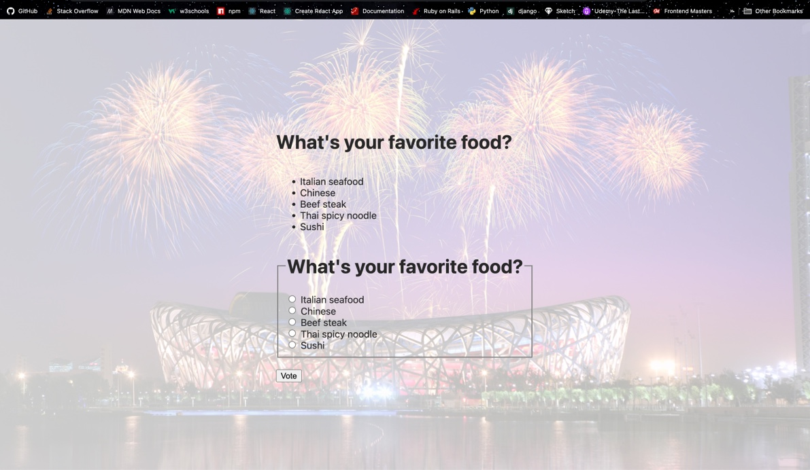
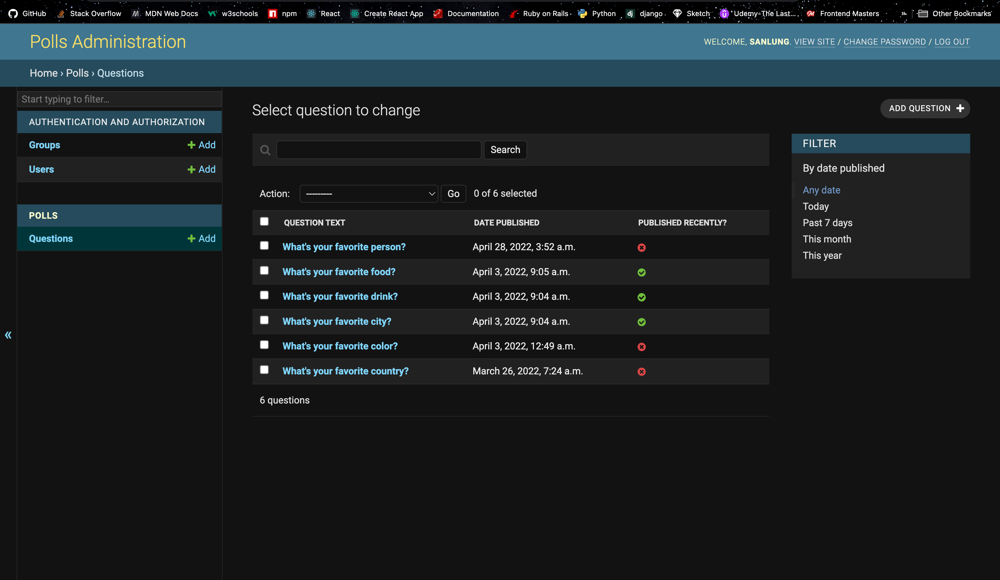

<p align="center"></p>
<h2 align="center">Chung Kao's</h2>
<h4 align="center">Django Polls-Site Tutotrial Project</h4>
<p align="center">Columbia University - Justice Through Code</p>
<p align="center"></p>

## About

This Django app is completed following Django's official tutorial, [Writing your first Django app](https://docs.djangoproject.com/en/4.0/intro/tutorial01/). The tutorial walks a beginner through a series of seven parts in Django fundamentals, namely:

-   Part 1: Requests and responses
-   Part 2: Models and the admin site
-   Part 3: Views and templates
-   Part 4: Forms and generic views
-   Part 5: Testing
-   Part 6: Static files
-   Part 7: Customizing the admin site

The tutorial is completed to complement learning through the Columbia University's Justice Through Code, Spring 2022 program. Participants of JTC undergo an intensive of Python programming and app development using the Django framework. Though completion of this toturial is not required by the program, it has furthered my understanding of the topics taught by JTC and has given me extra practices on using the Django framework to create web applications.

### The Polls App

The polls app has a simple interface which allows users to vote on the choices to questions posted on the page.



### The Admin Dashboard

The tutorial also guides the learner through customizing the admin dashboard.



### Usage

To clone a copy of this project using https, run the following command in the command line:

```bash
$ git clone https://github.com/Sanlung/django-tutorial-polls-site.git <your_project_directory_name>
```

To clone using SSH run the following command:

```bash
$ git clone git@github.com:Sanlung/django-tutorial-polls-site.git <your_project_directory_name>
```

Create a Python virtual environment and activate it in your local project: (assuming you already have Python installed)

```bash
$ cd <your_local_project_directory_name>
$ python3 -m venv venv
$ . venv/bin/activate
```

Install the packages in `requirements.txt`:

```bash
$ pip install -r requirements.txt
```

In the `pollsite` directory run the following command to start the server:

```bash
$ cd pollsite
$ python3 manage.py runserver
```

And you can take the app further with your own tweaks. The steps in the above are for Mac and Linux users. Please look up online for equivalent commands for Windows machines.

### Author

[](https://github.com/Sanlung)
